## Air Sensor test - 3 unit analysis

Devices as a part of this experiment:
-
-
-

## Battery status
The following graphs show battery charge percentage (%), current (mA) and voltage results (V). We can observe that all units are discharging at a similar rate during the experimentation, except unit 3714913954 which is for some reason reporting contant voltage.

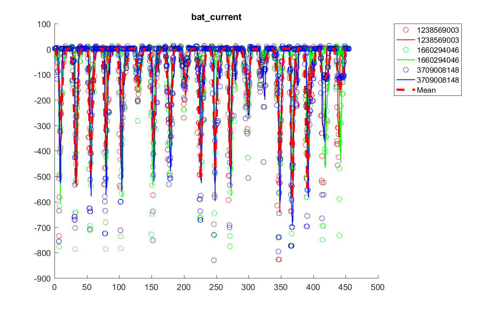

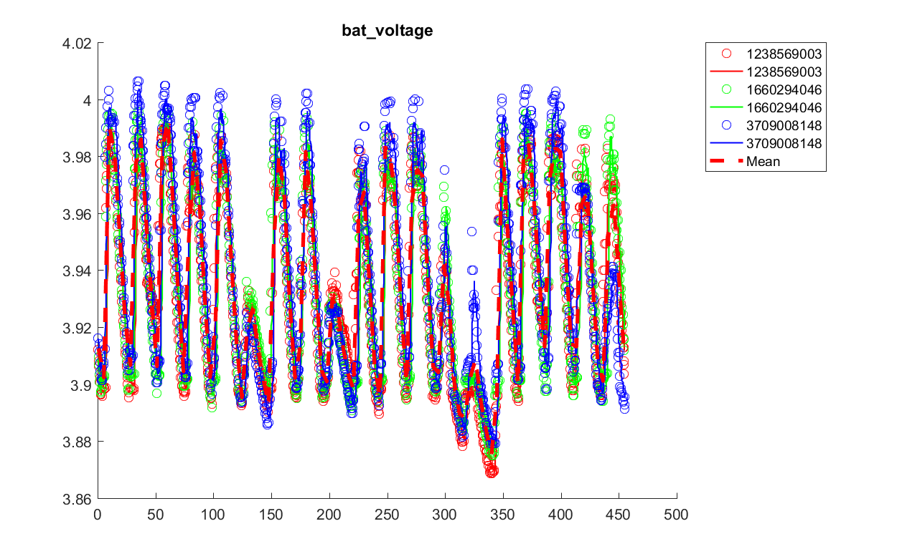

## Pressure, temperature and humidity
The following graphs show relative humidity (%), pressure (mbar) and temperature (deg C). We can observe the variance of co-located units in the measured values. Temperature between all units is within 1degC, while humidiry varies for about 2-3%, which is as specified for the [BME280](https://www.bosch-sensortec.com/bst/products/all_products/bme280) sensor in teh datasheet. Note vairation is between units as such, not just an error to the actual valuen of all sensors. ENV_HUMID value of unit 230442684 stands out and likely requires a sensor replacement.

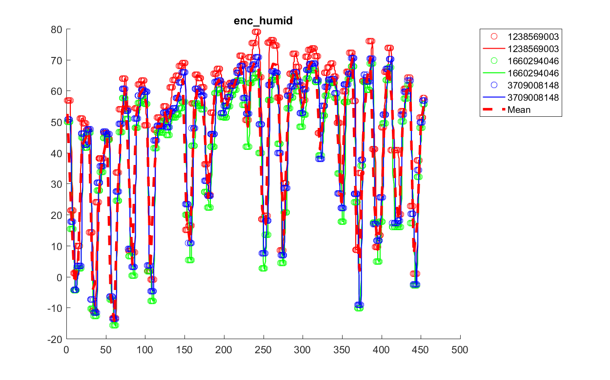

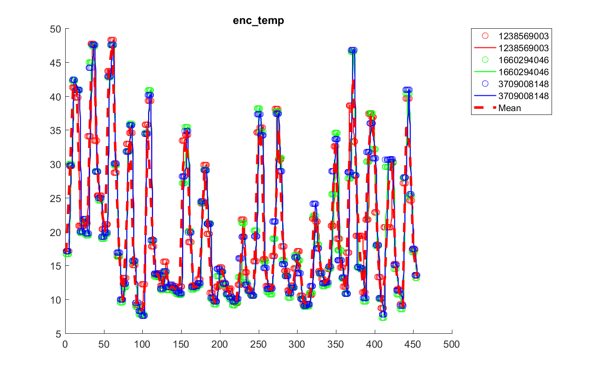

## Radiation
Radiation measurements are observed for any significant out of range values, we observe only the background radiation with a rather random pattern between units, ranging between 25 and 33 cpm for the compensated tube and 23 to 36 cpm for uncompensated.

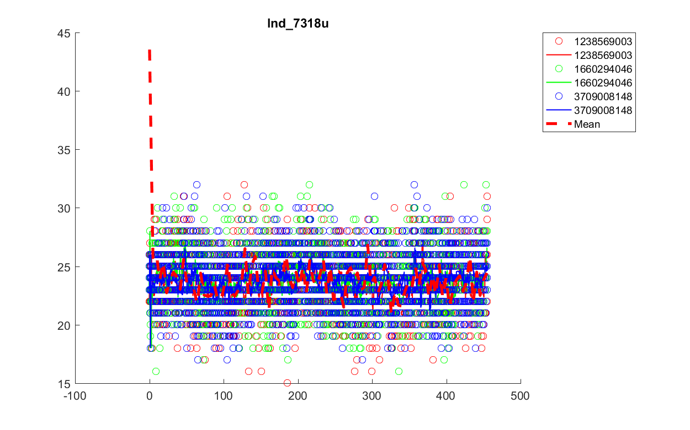

## OPC Air sensor PM values
Alpnasense OPC-N2 sensors return values of PM1, PM2.5 and PM10 counts in ug/m3 concentration. We observe that all sensors converge to 0 for the first part of the test in the clean air chamber and rise to the ambient level when the filtering is turned off. Ambient values have a reasonably large deviation between sensors as such, in the given case up to 20 ug/m3 variation at any given time. Note that sensors have consistenlty higher or lower values across all particle sizes and thus deviation is unit specific.

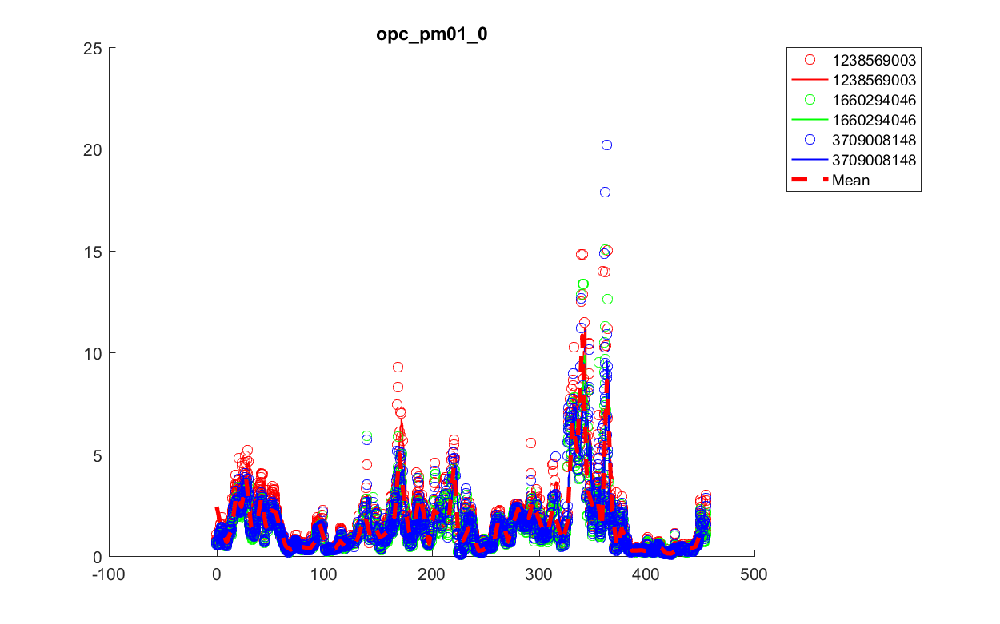

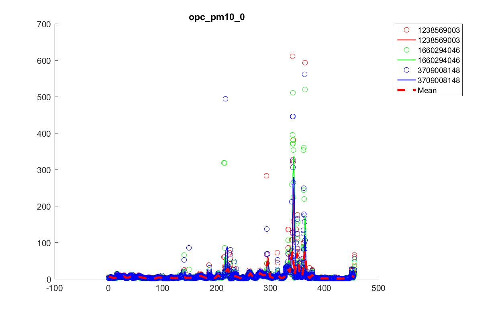

## PMS Air sensor PM values
APMS sensors returns values of PM1, PM2.5 and PM10 counts in ug/m3 concentration. We observe that all sensors converge to 0 for the first part of the test in the clean air chamber and rise to the ambient level when the filtering is turned off. Ambient values have a reasonably large deviation between sensors as such, in the given case up to 10 ug/m3 variation at any given time. Note that sensors have consistenlty higher or lower values across all particle sizes and thus deviation is unit specific.

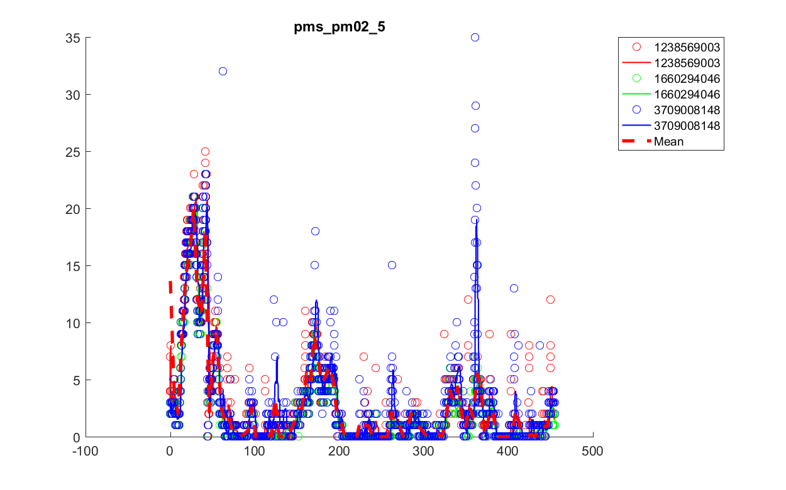

## OPC Air sensor raw bin count values
These raw bin count values are graphed for convenience of analysis.

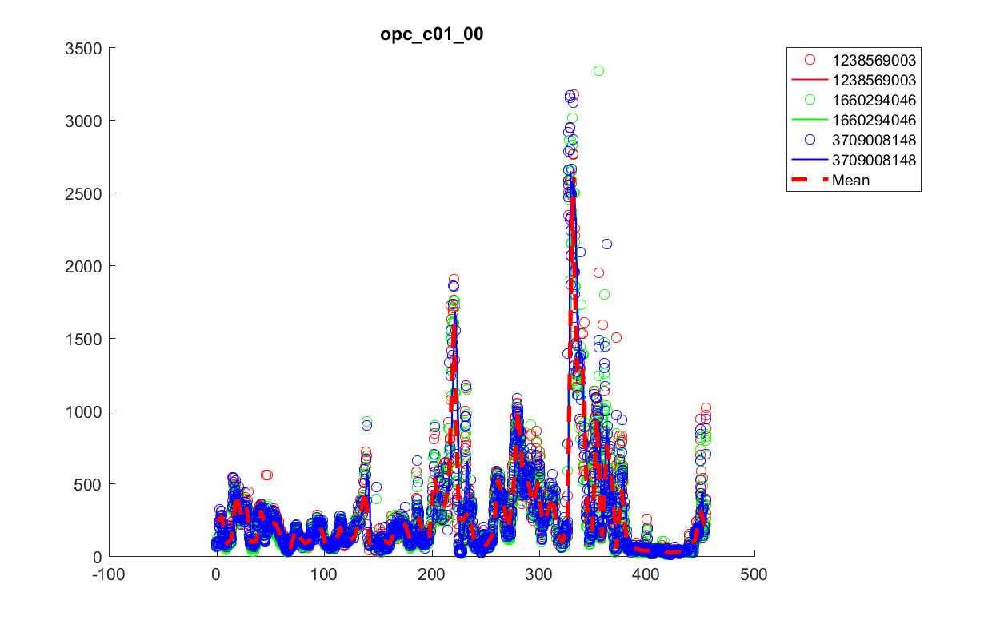

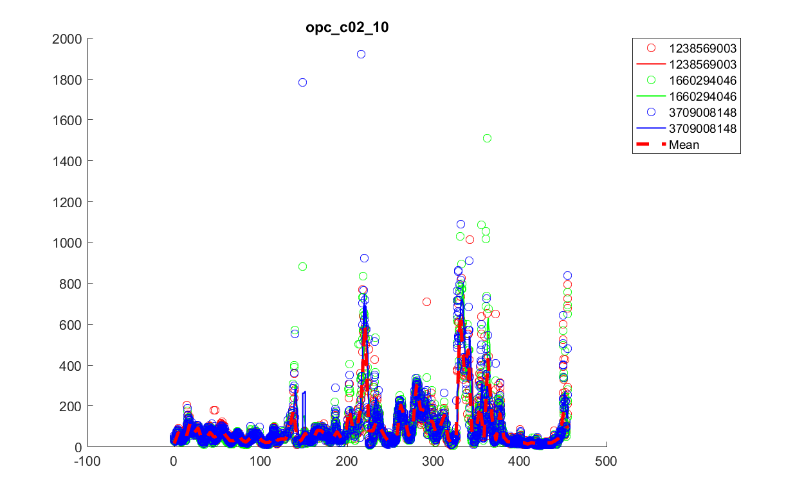

## PMS Air sensor raw bin count values
These raw bin count values are graphed for convenience of analysis.

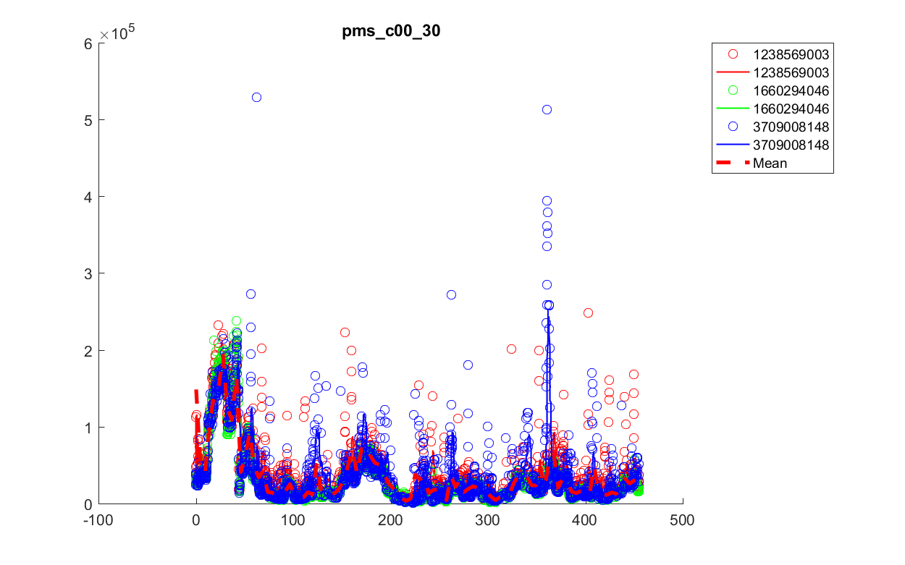

